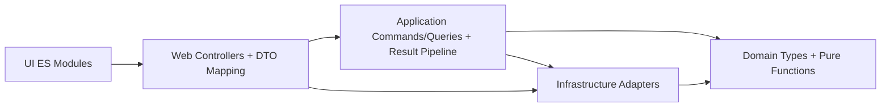

# Protocol Editor Modular Architecture ADR

- Status: Proposed
- Date: 2026-02-15
- Decision Drivers: Monolith decomposition, SOLID boundaries, functional core, stable route/payload/XML contracts

## Context

Current protocol editing/viewing behavior is concentrated in a few monolithic units:

- `SleepEditWeb/Views/ProtocolEditor/Index.cshtml` (large inline editor script, state + rendering + API calls)
- `SleepEditWeb/Views/ProtocolViewer/Index.cshtml` (inline viewer script + output composition)
- `SleepEditWeb/Controllers/ProtocolEditorController.cs` (route handling + validation + file/path policies + response mapping)
- `SleepEditWeb/Services/ProtocolEditorService.cs` (business mutations + undo/redo + traversal + link cleanup + cloning)

The target is a modular architecture with strict dependency direction, explicit ownership boundaries, and a functional core where pure functions own protocol-tree behavior.

## Decision

Adopt a layered modular architecture with these modules:

- `Protocol.Domain`: immutable protocol types and pure tree transformation rules
- `Protocol.Application`: command/query handlers, orchestration policies, `Result` pipelines
- `Protocol.Infrastructure`: XML mapping, persistence adapters, external IO
- `SleepEditWeb.Web`: ASP.NET controllers, request/response DTO mapping, DI composition
- `SleepEditWeb.UI`: ES modules for editor/viewer API, store, rendering, and interaction

### Boundary Diagram

## Module Boundaries and Ownership

| Module | Owns | Must Not Own | Allowed Dependencies |
| --- | --- | --- | --- |
| `Protocol.Domain` | Protocol invariants, tree operations, pure validation rules, structural transformations | HTTP, session, file IO, logging framework concerns | None |
| `Protocol.Application` | Use-case handlers (`AddSection`, `MoveNode`, `UpdateNode`, etc.), `Result` composition, transaction boundaries | XML element ordering details, Razor/DOM concerns | `Protocol.Domain` |
| `Protocol.Infrastructure` | XML serializer/deserializer, repository/session adapters, filesystem and DB integration | Route templates, UI state handling | `Protocol.Domain`, application abstractions |
| `SleepEditWeb.Web` | Route contracts, auth/antiforgery filters, request validation, response shaping | Core tree mutation logic, XML schema rules | `Protocol.Application`, `Protocol.Infrastructure` via abstractions |
| `SleepEditWeb.UI` | View bootstrap, API client calls, state store, rendering and interactions | Server-side path resolution, protocol invariants | Web endpoint contracts only |

## Dependency Direction Rules

1. `Domain` is dependency-free and side-effect-free.
2. `Application` depends only on `Domain` and abstraction interfaces.
3. `Infrastructure` depends on `Domain` and implements `Application` ports.
4. `Web` depends on `Application` contracts and mapping adapters, not concrete domain mutation internals.
5. `UI` depends on HTTP contracts, not server internals.
6. New code must not create reverse references (for example, `Domain -> Web`, `Domain -> Infrastructure`, `Application -> Razor`).

## Frontend Module Ownership and Guardrails

`SleepEditWeb.UI` is now split into focused ES modules:

- `protocol-editor-ui.js`: editor composition root, command wiring, status orchestration
- `protocol-tree.js`: tree rendering, selection, collapse state helpers
- `protocol-drag-drop.js`: drag/drop intent + move request construction
- `protocol-link-picker.js`: context menu and link-picker modal behavior
- `protocol-editor-api.js`: HTTP contract adapter for editor endpoints
- `protocol-editor-store.js`: editor state transitions
- `protocol-viewer-bootstrap.js`: thin viewer bootstrap entry point
- `protocol-viewer.js`: viewer UI behavior and output composition
- `protocol-shared-utils.js`: shared pure traversal/lookup/format helpers

Guardrail policy (enforced in CI by `SleepEditWeb/scripts/frontend-lint.mjs`):

1. `protocol-shared-utils.js`, `protocol-editor-api.js`, and `protocol-editor-store.js` are leaf utility modules (no local protocol imports).
2. `protocol-tree.js`, `protocol-drag-drop.js`, and `protocol-link-picker.js` may depend only on shared/pure helpers and must not import `protocol-editor-ui.js`.
3. `protocol-editor-ui.js` is the only editor composition module allowed to import multiple editor interaction modules.
4. `protocol-viewer-bootstrap.js` may only import `protocol-viewer.js`.
5. Protocol views must use `<script type="module">` and import only their respective bootstrap/composition module.
6. Frontend tests in `SleepEditWeb/wwwroot/js/__tests__` must use `.test.mjs` naming and cover pure helper/state logic.

## SOLID and Functional Rules

1. Single responsibility: one mutation/query intent per handler.
2. Open/closed: add behavior via new handlers/pure functions, avoid editing god-methods.
3. Interface segregation: prefer narrow ports (`IProtocolMutationHandler`, `IProtocolQueryHandler`, `IProtocolRepository`).
4. Dependency inversion: controller/service orchestration depends on interfaces, not concrete filesystem/session implementations.
5. Functional core, imperative shell: pure domain transformations return new values; IO stays in infrastructure/web edges.
6. Result pipelines: represent expected failures with `Result`/`Result<T>` and compose with `Map`/`Bind` patterns.

## Anti-Goals

1. No new god-services or expanding `ProtocolEditorService` responsibilities.
2. No route contract drift for existing protocol endpoints.
3. No XML schema element/order drift (`Id`, `LinkId`, `LinkText`, `text`, `SubText`).
4. No additional feature-flag gating for modularization rollout in this greenfield stream.
5. No new large inline scripts in Razor views.

## Backward Compatibility Constraints (Must Preserve)

### Route and Endpoint Contract

Controller route base:

- `SleepEditWeb/Controllers/ProtocolEditorController.cs:11` -> `[Route("ProtocolEditor")]`

Action templates:

- `SleepEditWeb/Controllers/ProtocolEditorController.cs:33` -> `GET ""`
- `SleepEditWeb/Controllers/ProtocolEditorController.cs:50` -> `GET "State"`
- `SleepEditWeb/Controllers/ProtocolEditorController.cs:63` -> `POST "AddSection"`
- `SleepEditWeb/Controllers/ProtocolEditorController.cs:78` -> `POST "AddChild"`
- `SleepEditWeb/Controllers/ProtocolEditorController.cs:99` -> `POST "RemoveNode"`
- `SleepEditWeb/Controllers/ProtocolEditorController.cs:120` -> `POST "UpdateNode"`
- `SleepEditWeb/Controllers/ProtocolEditorController.cs:146` -> `POST "MoveNode"`
- `SleepEditWeb/Controllers/ProtocolEditorController.cs:171` -> `POST "AddSubText"`
- `SleepEditWeb/Controllers/ProtocolEditorController.cs:192` -> `POST "RemoveSubText"`
- `SleepEditWeb/Controllers/ProtocolEditorController.cs:213` -> `POST "Undo"`
- `SleepEditWeb/Controllers/ProtocolEditorController.cs:227` -> `POST "Redo"`
- `SleepEditWeb/Controllers/ProtocolEditorController.cs:241` -> `POST "Reset"`
- `SleepEditWeb/Controllers/ProtocolEditorController.cs:255` -> `GET "ExportXml"`
- `SleepEditWeb/Controllers/ProtocolEditorController.cs:269` -> `POST "SaveXml"`
- `SleepEditWeb/Controllers/ProtocolEditorController.cs:320` -> `POST "SetDefaultProtocol"`
- `SleepEditWeb/Controllers/ProtocolEditorController.cs:371` -> `POST "ImportXml"`
- `SleepEditWeb/Controllers/ProtocolEditorController.cs:424` -> `POST "ImportXmlUpload"`

### State Response Shape

`ToStateResponse` currently returns:

- `document`
- `undoCount`
- `redoCount`
- `lastUpdatedUtc`

Source: `SleepEditWeb/Controllers/ProtocolEditorController.cs:583`

### XML Wire Contract

Preserve:

- Root/child elements: `Protocol`, `Section`, `SubSection`
- Field order: `Id`, `LinkId`, `LinkText`, `text`, then optional repeated `SubText`
- Recursive subsection hierarchy behavior

Source: `SleepEditWeb/Services/ProtocolXmlService.cs` and `docs/protocol-editor-reference-contract.md`

### UI Contract Markers

Keep wording and endpoint references validated by tests:

- `>Import Protocol<`, `>Save Protocol<`, `>Export Protocol<`
- `"/ProtocolEditor/ImportXmlUpload"`, `"/ProtocolEditor/SaveXml"`, `ExportXml` usage

Source: `SleepEditWeb.Tests/ProtocolEditorUiContractsTests.cs:48`

## Migration Map (Exact Integration Points)

| Phase | Integration Points | Outcome |
| --- | --- | --- |
| 0. Contract Baseline | `SleepEditWeb.Tests/ProtocolEditorUiContractsTests.cs`, `SleepEditWeb.Tests/ProtocolXmlServiceTests.cs`, `SleepEditWeb.Tests/ProtocolEditorServiceTests.cs` | Freeze route/payload/XML behavior before refactor |
| 1. Composition Root Seams | `SleepEditWeb/Program.cs:24`, `SleepEditWeb/Program.cs:25`, `SleepEditWeb/Program.cs:26`, `SleepEditWeb/Program.cs:27` | Replace direct concrete registrations with module interfaces/adapters |
| 2. Domain Extraction | `SleepEditWeb/Models/ProtocolEditorModels.cs`, mutation helpers in `SleepEditWeb/Services/ProtocolEditorService.cs` | Move tree invariants and transforms to pure domain functions and immutable types |
| 3. Application Layer | Public mutation/query methods in `SleepEditWeb/Services/ProtocolEditorService.cs` | Replace procedural orchestration with command/query handlers returning `Result` |
| 4. Infrastructure Isolation | `SleepEditWeb/Services/ProtocolXmlService.cs`, `SleepEditWeb/Services/ProtocolEditorSessionStore.cs` | Keep serialization/persistence in adapters behind interfaces |
| 5. Controller Slimming | `SleepEditWeb/Controllers/ProtocolEditorController.cs` | Controller becomes contract adapter: validate/map/delegate/respond |
| 6. Editor UI API + Store Split | API and state logic now in `SleepEditWeb/Views/ProtocolEditor/Index.cshtml` around `fetch` and `state` | Extract `protocol-editor-api.js` and `protocol-editor-store.js`; keep thin bootstrap in Razor |
| 7. Editor UI Interaction Split | `SleepEditWeb/wwwroot/js/protocol-editor-ui.js`, `SleepEditWeb/wwwroot/js/protocol-tree.js`, `SleepEditWeb/wwwroot/js/protocol-drag-drop.js`, `SleepEditWeb/wwwroot/js/protocol-link-picker.js` | Extracted focused modules for rendering, DnD, link picker, details panel, keyboard shortcuts |
| 8. Viewer UI Modularization | `SleepEditWeb/wwwroot/js/protocol-viewer.js`, `SleepEditWeb/wwwroot/js/protocol-viewer-bootstrap.js`, `SleepEditWeb/wwwroot/js/protocol-shared-utils.js` | Extracted viewer modules and shared pure UI helpers |
| 9. Rollout and Operations | `docs/protocol-editor-deployment-runbook.md`, `docs/protocol-editor-usage.md` | Update runbook and smoke tests for modularized implementation |

## Consequences

Positive:

- Clear ownership boundaries and dependency flow.
- Lower change risk by preserving route/payload/XML contracts.
- Better testability via pure functions and smaller modules.
- Reduced frontend coupling and easier incremental delivery.

Tradeoffs:

- Temporary adapter layer duplication during migration.
- Additional mapping code between legacy mutable DTOs and domain records.
- Up-front architecture discipline required to prevent boundary erosion.
